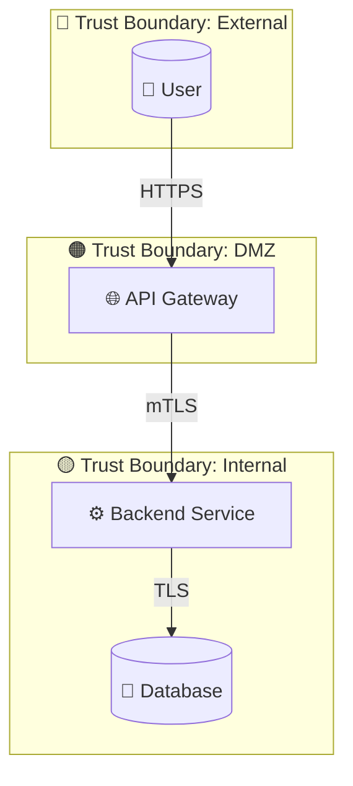
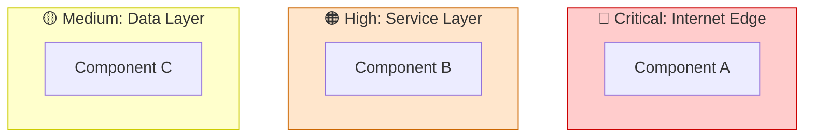
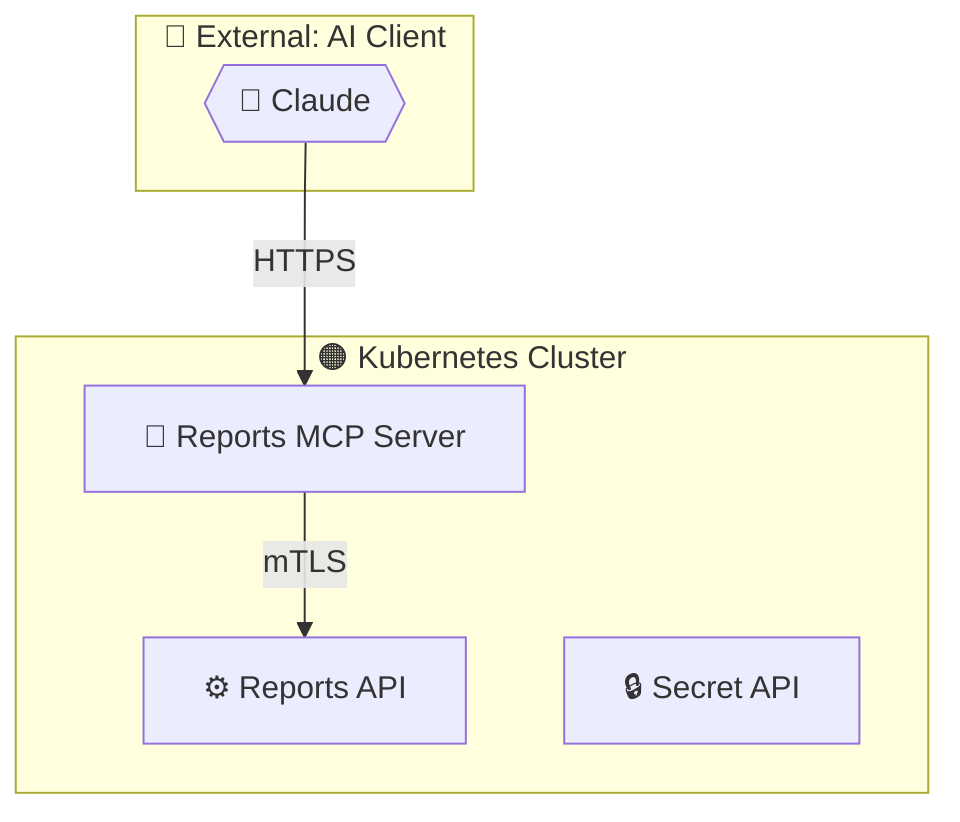
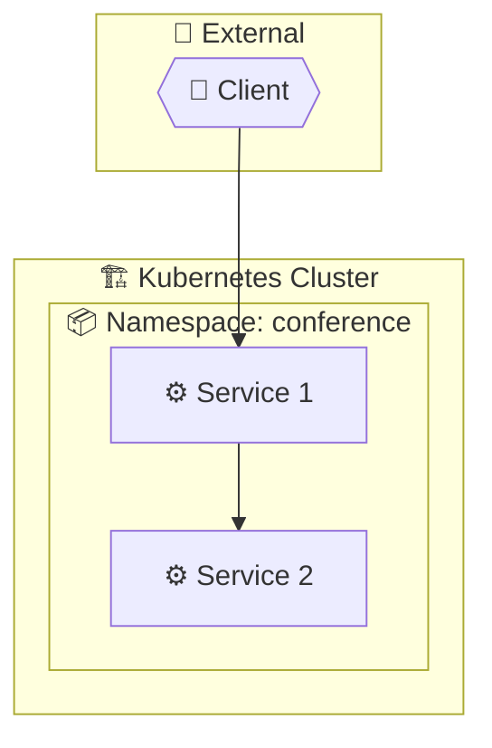
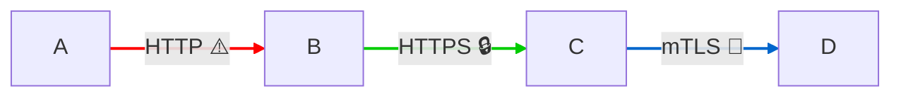
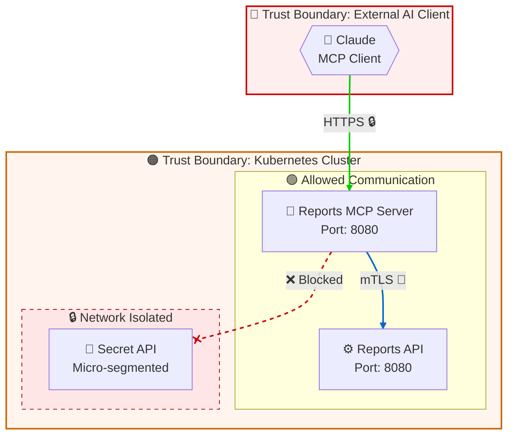

# Data Flow Diagram Generation Guide

## Overview

Generate Mermaid flowchart diagrams from CALM architectures that clearly show:
- System components (nodes)
- Data flows (relationships)
- Trust boundaries (as subgraphs)

## Mermaid Flowchart Structure

Use `flowchart TB` (top-to-bottom) or `flowchart LR` (left-to-right) with subgraphs for trust boundaries.

### Basic Template



## Node Shape Mapping

Map CALM node types to Mermaid shapes:

| CALM Node Type | Mermaid Shape | Icon | Example |
|----------------|---------------|------|---------|
| `actor` / `user` | `(( ))` Stadium | 👤 | `User(("👤 User"))` |
| `service` | `[ ]` Rectangle | ⚙️ | `API["⚙️ API Service"]` |
| `database` | `[( )]` Cylinder | 💾 | `DB[("💾 Database")]` |
| `mcp-client` | `{{ }}` Hexagon | 🤖 | `Claude{{"🤖 Claude"}}` |
| `mcp-server` | `[ ]` Rectangle | 🔧 | `MCP["🔧 MCP Server"]` |
| `system` | `[[ ]]` Subroutine | 🏗️ | `K8s[["🏗️ K8s Cluster"]]` |
| `external-system` | `> ]` Flag | 🌍 | `Ext>"🌍 External API"]` |
| `queue` | `[/ /]` Parallelogram | 📬 | `Queue[/"📬 Message Queue"/]` |

## Trust Boundary Styling

Use subgraph styling to indicate criticality:



## Converting CALM to Mermaid

### Step 1: Extract Nodes

From CALM:
```json
{
  "nodes": [
    {"unique-id": "mcp-client", "name": "Claude", "node-type": "mcp-client"},
    {"unique-id": "mcp-server", "name": "Reports MCP Server", "node-type": "service"},
    {"unique-id": "reports-api", "name": "Reports API", "node-type": "service"}
  ]
}
```

To Mermaid:
```mermaid
Claude{{"🤖 Claude"}}
MCP["🔧 Reports MCP Server"]
Reports["⚙️ Reports API"]
```

### Step 2: Extract Relationships

From CALM:
```json
{
  "relationships": [
    {
      "unique-id": "mcp-client-mcp-server",
      "protocol": "HTTPS",
      "relationship-type": {
        "connects": {
          "source": {"node": "mcp-client"},
          "destination": {"node": "mcp-server"}
        }
      }
    }
  ]
}
```

To Mermaid:
```mermaid
Claude -->|"HTTPS"| MCP
```

### Step 3: Identify and Create Trust Boundary Subgraphs

Based on the trust boundary analysis, group nodes:



### Step 4: Add Deployment Context

For `deployed-in` relationships, use nested subgraphs:



## Protocol Styling

Use link styles to indicate security level:



| Protocol | Style | Icon |
|----------|-------|------|
| HTTP | Red dashed | ⚠️ |
| HTTPS | Green solid | 🔒 |
| mTLS | Blue bold | 🔐 |
| gRPC | Purple | 🔄 |

## Complete Example

For a CALM architecture with MCP components:



## Diagram Best Practices

1. **Keep it readable**: Limit to 10-15 nodes per diagram; create sub-diagrams for complex systems
2. **Consistent orientation**: Use TB for hierarchical, LR for flow-based architectures
3. **Label everything**: Include protocols, ports, and key security indicators
4. **Color coding**: Use consistent colors for trust boundary criticality
5. **Show what's blocked**: Use dashed lines with ❌ to show denied connections
6. **Include legends**: Add a legend for complex diagrams

## Legend Template

Add this below complex diagrams:

```markdown
**Legend:**
- 🔴 Critical trust boundary (internet-facing)
- 🟠 High trust boundary (internal zones)
- 🟡 Medium trust boundary (same zone)
- 🔒 HTTPS encrypted
- 🔐 mTLS mutual authentication
- ❌ Blocked/denied connection
```
