# Threat Model Output Template

## Overview

This template defines the structure of the `threat-model.md` output file. Generate this file in the root of the CALM architecture or in a location specified by the user.

## Complete Template

````markdown
# STRIDE Threat Model

> **Generated by:** STRIDER (STRIDE Threat Modeling for CALM Architectures)  
> **Architecture:** [Architecture Name from CALM]  
> **Version:** [Architecture Version]  
> **Date:** [Generation Date]  
> **Status:** Draft - For Discussion

---

## Executive Summary

[2-3 sentence summary of the architecture and key security findings]

**Key Findings:**
- 🔴 **Critical:** [X] unmitigated threats requiring immediate attention
- 🟠 **High:** [X] threats with partial mitigations
- 🟡 **Medium:** [X] threats with adequate controls
- 🟢 **Low:** [X] threats fully mitigated

---

## Table of Contents

1. [System Overview](#system-overview)
2. [Data Flow Diagram](#data-flow-diagram)
3. [Trust Boundary Inventory](#trust-boundary-inventory)
4. [STRIDE Threat Analysis](#stride-threat-analysis)
5. [AI Governance Analysis](#ai-governance-analysis) *(if applicable)*
6. [Recommendations](#recommendations)
7. [Appendix: CALM Controls](#appendix-calm-controls)

---

## System Overview

### Architecture Description

[Description derived from CALM architecture]

### Components

| Component | Type | Description | Interfaces |
|-----------|------|-------------|------------|
| [Node name] | [node-type] | [description] | [interfaces] |

### Technology Stack

| Layer | Technology | Notes |
|-------|------------|-------|
| Frontend | [Technology] | |
| Backend | [Technology] | |
| Data | [Technology] | |
| Infrastructure | [Technology] | |
| AI/ML | [If applicable] | |

---

## Data Flow Diagram

```mermaid
flowchart TB
    subgraph TB1["🔴 Trust Boundary: [Name]"]
        %% Components in boundary 1
    end
    
    subgraph TB2["🟠 Trust Boundary: [Name]"]
        %% Components in boundary 2
    end
    
    %% Relationships
    Component1 -->|"Protocol"| Component2
```



**Legend:**
- 🔴 Critical trust boundary (internet-facing)
- 🟠 High trust boundary (internal zones)
- 🟡 Medium trust boundary (same zone)
- 🔒 HTTPS encrypted
- 🔐 mTLS mutual authentication
- ❌ Blocked/denied connection

---

## Trust Boundary Inventory

| ID | Boundary Name | From | To | Protocol | Criticality |
|----|---------------|------|-----|----------|-------------|
| TB-1 | [Name] | [Source] | [Destination] | [Protocol] | [🔴/🟠/🟡/🟢] |
| TB-2 | [Name] | [Source] | [Destination] | [Protocol] | [🔴/🟠/🟡/🟢] |

---

## STRIDE Threat Analysis

### TB-1: [Trust Boundary Name]

**Boundary Details:**
- **From:** [Source Component]
- **To:** [Destination Component]
- **Protocol:** [Communication Protocol]
- **Criticality:** [🔴 Critical / 🟠 High / 🟡 Medium / 🟢 Low]

| STRIDE | Threat | Risk | Existing Control | Mitigation Status |
|--------|--------|------|------------------|-------------------|
| 🎭 Spoofing | [Threat description] | H/M/L | [Control or "None"] | ✅/⚠️/❌ |
| 🔧 Tampering | [Threat description] | H/M/L | [Control or "None"] | ✅/⚠️/❌ |
| 🙈 Repudiation | [Threat description] | H/M/L | [Control or "None"] | ✅/⚠️/❌ |
| 📤 Info Disclosure | [Threat description] | H/M/L | [Control or "None"] | ✅/⚠️/❌ |
| 🚫 DoS | [Threat description] | H/M/L | [Control or "None"] | ✅/⚠️/❌ |
| ⬆️ Elevation | [Threat description] | H/M/L | [Control or "None"] | ✅/⚠️/❌ |

**Discussion Points:**
- [Question for discussion 1]
- [Question for discussion 2]

---

### TB-2: [Trust Boundary Name]

[Repeat for each trust boundary]

---

## Threat Summary

| Trust Boundary | 🎭 | 🔧 | 🙈 | 📤 | 🚫 | ⬆️ | Overall |
|----------------|----|----|----|----|----|----|---------|
| TB-1: [Name] | [Status] | [Status] | [Status] | [Status] | [Status] | [Status] | [🔴/🟠/🟡/🟢] |
| TB-2: [Name] | [Status] | [Status] | [Status] | [Status] | [Status] | [Status] | [🔴/🟠/🟡/🟢] |

**Legend:** ✅ Mitigated | ⚠️ Partial | ❌ Unmitigated | ➖ N/A

---

## AI Governance Analysis

> ⚠️ **This section is included because AI/MCP components were detected in the architecture.**

Refer to the [FINOS AI Governance Framework](https://air-governance-framework.finos.org) for detailed guidance.

### AI Components Identified

| Component | Type | Description |
|-----------|------|-------------|
| [Component name] | [MCP Client/Server/Agent/LLM] | [Description] |

### AI-Specific Risks

| Risk ID | Risk Name | Impact | Current Controls | Status |
|---------|-----------|--------|------------------|--------|
| AIR-SEC-024 | Prompt Injection | [Impact] | [Controls] | [✅/⚠️/❌] |
| AIR-SEC-026 | Tool Chain Manipulation | [Impact] | [Controls] | [✅/⚠️/❌] |
| AIR-SEC-027 | MCP Server Supply Chain | [Impact] | [Controls] | [✅/⚠️/❌] |
| AIR-OP-028 | Multi-Agent Trust Violations | [Impact] | [Controls] | [✅/⚠️/❌] |

### AI Trust Boundaries

| Boundary | Description | Special Considerations |
|----------|-------------|----------------------|
| Human ↔ AI | [Description] | [Considerations] |
| AI ↔ Tools | [Description] | [Considerations] |

### Recommended AI Mitigations

Based on the FINOS AI Governance Framework:

1. **[Mitigation Category]** (AIR-[ID])
   - [Specific recommendation]

---

## Recommendations

### Immediate Actions (🔴 Critical)

| # | Recommendation | Trust Boundary | Threat Addressed |
|---|----------------|----------------|------------------|
| 1 | [Recommendation] | TB-X | [STRIDE category] |

### Short-Term Actions (🟠 High)

| # | Recommendation | Trust Boundary | Threat Addressed |
|---|----------------|----------------|------------------|
| 1 | [Recommendation] | TB-X | [STRIDE category] |

### Long-Term Actions (🟡 Medium)

| # | Recommendation | Trust Boundary | Threat Addressed |
|---|----------------|----------------|------------------|
| 1 | [Recommendation] | TB-X | [STRIDE category] |

---

## Appendix: CALM Controls

The following controls are defined in the CALM architecture and were considered during this threat model:

### [Control Name]

```json
{
  "controls": {
    "[control-id]": {
      "description": "[description]",
      "requirements": [
        {
          "requirement-url": "[url]",
          "config-url": "[url]"
        }
      ]
    }
  }
}
```

**Applied to:** [Node(s) or architecture level]
**Mitigates:** [List of threats this control addresses]

---

## Document History

| Version | Date | Author | Changes |
|---------|------|--------|---------|
| 1.0 | [Date] | STRIDER | Initial threat model |

---

## References

- [OWASP Threat Modeling Cheat Sheet](https://cheatsheetseries.owasp.org/cheatsheets/Threat_Modeling_Cheat_Sheet.html)
- [FINOS AI Governance Framework](https://air-governance-framework.finos.org)
- [FINOS CALM Specification](https://calm.finos.org)
- [Microsoft STRIDE](https://learn.microsoft.com/en-us/previous-versions/commerce-server/ee823878(v=cs.20))
````

## Generation Guidelines

### 1. File Location

- Default: `threat-model.md` in the same directory as the CALM architecture
- Alternative: User-specified location

### 2. Section Inclusion

- **Always include:** System Overview, Data Flow, Trust Boundaries, STRIDE Analysis, Recommendations
- **Conditionally include:** AI Governance Analysis (only if AI components detected)
- **Optional:** Appendix (include if architecture has controls)

### 3. Tone and Style

- **Professional but accessible**: Suitable for cross-functional teams
- **Actionable**: Focus on "what to do" not just "what could go wrong"
- **Discussion-oriented**: Include questions, not just statements
- **Balanced**: Acknowledge both risks and existing mitigations

### 4. Content Quality

- **Be specific**: Reference actual component names from the CALM architecture
- **Be complete**: Cover all trust boundaries
- **Be honest**: Mark unmitigated threats as ❌
- **Be helpful**: Prioritize recommendations by criticality

### 5. Formatting

- Use consistent emoji usage throughout
- Use proper Markdown table formatting
- Ensure Mermaid diagrams render correctly
- Include anchors for table of contents navigation
